# Financial Fraud Detection Project

Detecting financial fraud using data analysis and machine learning techniques. Includes data preprocessing, feature engineering, model training, and evaluation to identify anomalous or high-risk financial transactions.

## Type of project

- Data exploration with SQL
- Data visualization with Python
- Predictive model

## Repository Structure

    ├── data
    ├──── processed
    ├──── raw
    ├── experiments
    ├── images
    ├── models
    ├── reports
    ├── src
    ├── README.md
    └── .gitignore

- Data: raw, processed and final data.
- Experiments: Experiments.
- Images: Final images.
- Models: Trained models or model predictions.
- Reports: Generated HTML, PDF etc. of the analysis report.
- src: Project source code.
- README: This file.
- .gitignore: Files to exclude from this folder.

## Team Members

- Mariluz Lopez Zamora
- Joshua Okojie

### Initial Phase Contributor
- Lindsay Hudson

## Chosen Dataset: Financial Transactions Dataset for Fraud Detection

- URL: <https://www.kaggle.com/datasets/aryan208/financial-transactions-dataset-for-fraud-detection/data>

## Project Overview

- [Purpose and Overview](#purpose-and-overview)
- [Methodology](#methodology)
- [Data Cleaning](#data-cleaning)
- [Predictive Model](#predictive-model)
- [Technical Stack](#technical-stack)
- [References](#references)

### Purpose and Overview

#### Business Problem

Financial fraud has increased substantially in recent years, costing institutions and consumers hundreds of millions of dollars annually (Hilal et al. 2022). In response, the financial sector has implemented increasingly sophisticated prevention measures, including fraud-detection systems that rely on anomaly-detection techniques to identify unusual or suspicious behavior. Over the past several decades, these methods have advanced significantly, driven by progress in statistical modeling, artificial intelligence, and machine learning (ML). Among the various types of financial fraud, credit card fraud remains one of the most prevalent and costly, making it a major priority for financial institutions.

This project focuses on developing a machine learning model capable of accurately detecting fraudulent credit card transactions, enabling faster identification, intervention, and protection for all stakeholders.

#### Stakeholders

- Financial Institutions
  - Minimize financial losses by strengthening early detection of fraudulent transactions and reducing the impact of high‑risk events.

  - Identify complex and previously undetected fraud patterns to support the development of proactive, data‑driven prevention strategies and enhance the overall effectiveness of fraud‑mitigation systems.

- Customers
  - Benefit from increased protection of their accounts and reduced exposure to fraudulent activity.

### Dataset Fraud Detection Scores

The dataset selected from Kaggle consists of 5 million synthetically generated financial transactions. It is designed to simulate real-world transactional behavior for fraud detection research and machine learning applications.

The dataset includes 18 attributes, among them the target variable is_fraud and three types of anomaly scores: spending_deviation_score, velocity_score, and geo_anomaly_score.

  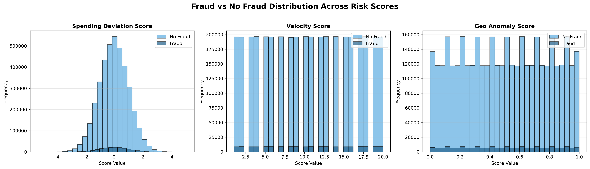   

- **Velocity Score:**
  The score is typically calculated by counting the number of transactions per unit of time and comparing it with historical averages.

  A high velocity score indicates unusually rapid activity, which may suggest potential card theft or automated fraud. A low score generally reflects a normal transaction pace.

- **Spending Deviation Score:**
  A High score means a transaction amount is far from normal as a possible fraud. A Low score means a transaction is consistent with past behavior.
  It measures how unusual a transaction amount is compared to the customer’s historical spending.

  A high score indicates that the transaction amount is far from the customer’s normal pattern and may signal potential fraud. A low score suggests the transaction is consistent with past behavior.

- **Geo Anomaly Score:**
  It is a measure of geographic inconsistencies in transaction locations. It compares the current transaction location with previous ones and checks whether the distance and timing are feasible. For example, a purchase in Toronto followed by another in Tokyo within 10 minutes would be flagged.
  A high score indicates impossible or highly improbable travel and is therefore suspicious. A low score means the transaction location is consistent with the customer’s usual pattern.

### Feature description

| Feature                     | Type      | Distinct Values | Description                                                                   | Notes                                                                                  |
| --------------------------- | --------- | --------------- | ----------------------------------------------------------------------------- | -------------------------------------------------------------------------------------- |
| transaction_id              | VARCHAR   | 5,000,000       | Unique identifier for each transaction.                                       | All unique.                                                                            |
| timestamp                   | TIMESTAMP | 4,999,998       | Date and time the transaction occurred (ISO8601).                             | Two timestamps are duplicated; no nulls. Useful for extracting month/day/hour.         |
| sender_account              | VARCHAR   | 896,513         | Sender account number (hashed).                                               | High cardinality.                                                                      |
| receiver_account            | VARCHAR   | 896,639         | Destination account number (hashed).                                          | High cardinality.                                                                      |
| amount                      | DOUBLE    | 217,068         | Monetary value of the transaction.                                            | Ranges from 0.01 to 3520.57; may be bucketed into ranges.                              |
| transaction_type            | VARCHAR   | 4               | deposit, payment, transfer, withdrawal.                                       | Categorical.                                                                           |
| merchant_category           | VARCHAR   | 8               | entertainment, grocery, online, other, restaurant, retail, travel, utilities. | Categorical.                                                                           |
| location                    | VARCHAR   | 8               | Berlin, Dubai, London, New York, Singapore, Sydney, Tokyo, Toronto.           | Geographic categorical.                                                                |
| device_used                 | VARCHAR   | 4               | atm, mobile, pos, web.                                                        | Device used to initiate the transaction.                                               |
| is_fraud                    | BOOLEAN   | 2               | Binary flag indicating fraud (1) or legitimate (0).                           | Binary target variable.                                                                |
| fraud_type                  | VARCHAR   | 2               | card_not_present, none.                                                       | Very low value; candidate for removal or merging.                                      |
| time_since_last_transaction | DOUBLE    | 4,103,488       | Time elapsed since the user's previous transaction.                           | Ranges from -8777.81 to 8757.76; may be bucketed into time ranges or outlier handling. |
| spending_deviation_score    | DOUBLE    | 917             | Deviation from typical spending habits.                                       | Ranges from -5.26 to 5.02. Continuous.                                                 |
| velocity_score              | BIGINT    | 20              | Measure of transaction frequency in a short window.                           | Discrete range from 1 to 20.                                                           |
| geo_anomaly_score           | DOUBLE    | 101             | Score based on unusual distance between transactions.                         | Ranges from 0 to 1 (decimal).                                                          |
| payment_channel             | VARCHAR   | 4               | ACH, UPI, card, wire_transfer.                                                | Categorical.                                                                           |
| ip_address                  | VARCHAR   | 4,997,068       | IP address from which the transaction was initiated (hashed).                 | Very high cardinality.                                                                 |
| device_hash                 | VARCHAR   | 3,835,723       | Unique digital fingerprint of the hardware (hashed).                          | Very high cardinality.                                                                 |

### Methodology

#### Data Exploration

The downloaded CSV file containing the original dataset was converted into columnar Parquet files, which are much faster to query. After that, data exploration and cleaning were performed using SQL queries in DuckDB to improve memory efficiency.

The initial data exploration revealed that the dataset has a significant class imbalance. Out of 5 million transactions, the number of positive fraud cases is 179,553, while negative (non-fraud) cases total 4,820,447, resulting in a fraud ratio of 0.035911 and a non-fraud ratio of 0.964089.

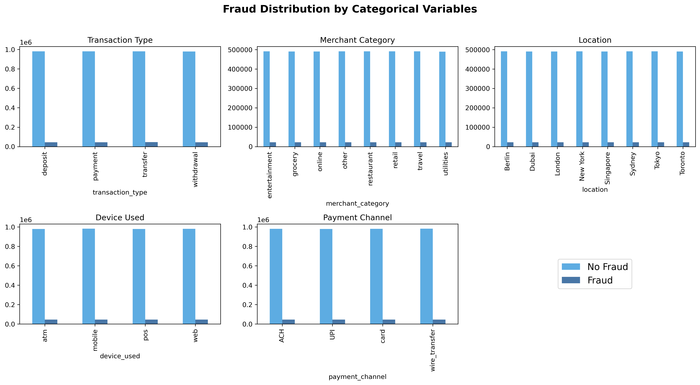   

The dataset spans a one-year period, from 2023-01-01 to 2024-01-01. In addition, all columns are stored in a consistent internal format, and no random spaces were found; therefore, no adjustments were required.

**Missing and Null Values:**

Data exploration identified two features with NULL values: time_since_last_transaction (896,513) and fraud_type (4,820,447).

However, no NULL values were found among positive fraud cases. All NULL values belong to the is_fraud = FALSE category, as this group contains the largest number of observations, with a non-fraud transaction ratio of 0.96 compared to a fraud transaction ratio of 0.035. Therefore, removing records with NULL values does not affect the minority class, which is also the class of interest for identifying fraud patterns.

**Identifier Features for Future Anonymization:**

- sender_account
- receiver_account
- transaction_id
- ip_address 
- device_hash.

**Unique Values and repetitions:**

Repeated values were found among the identifier features (Sender_account, receiver_account, ip_adress and device_hash). Sender_account and receiver_account showed potential anomalies, with 896,513 and 896,639 unique values, respectively, in a dataset of 5 million transactions. For this reason, a deeper analysis was performed focusing on fraud-positive cases.

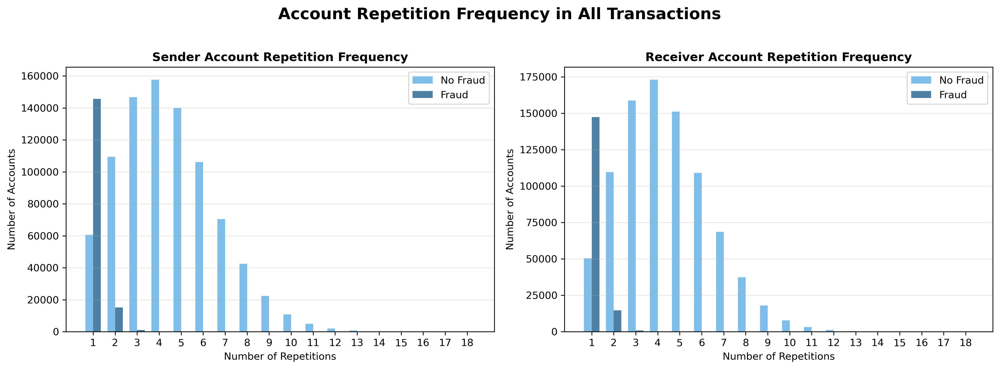   

In the fraud-positive transactions, sender_account had 16,337 repeated values, with a maximum of 7 repetitions, while receiver_account had 15,604 repeated values, with a maximum of 5 repetitions.

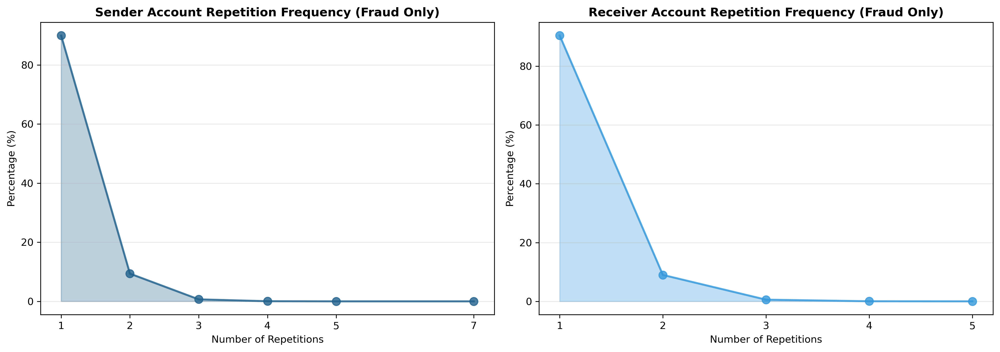  

Both sender_account and receiver_account show a highly skewed distribution. Most accounts appear only once or twice, while very few accounts appear multiple times. For example, in sender_account, only one value appears 7 times and two values appear 5 times, compared to more than 145,000 values that appear only once. A similar pattern is observed for receiver_account, indicating that repeated accounts are extremely rare and that the dataset is dominated by unique or low-frequency account identifiers.

**Negative values on time_since_last_transaction:**

Negative values were found in the time_since_last_transaction feature. The dataset does not provide information about how this variable was calculated or why negative values exist.

The minimum value is -8748.17 (with 89,880 fraud cases showing negative values), and the maximum value is 8744.77 (with 89,673 fraud cases showing positive values). These values are close to the approximate number of hours in a year (8,760), but negative values are illogical because they would imply that some transactions occurred in the future relative to previous ones.

Additional analyses were performed to understand this behavior. First, it was tested whether negative values were related to specific geographic locations, possibly due to time zone differences, but no correlation was found.

Finally, transactions were grouped by sender_account, ordered by timestamp, and the time differences were recalculated. This approach also showed no meaningful pattern, likely because the dataset does not contain complete transaction histories for each user. As a result, this feature cannot be reliably reconstructed or interpreted.

**Other Feature:**

Fraud cases were found across all payment_channel categories, which indicates that all categories are significant.
From Fraud Cases positive: the Min amount was 0.01 and Max Amount was 3128.14

### Data cleaning

Data cleaning was conducted with SQL queries and The cleaned table was saved as a Parquet file for modeling.

#### Feature engineering:

- Timestamp was divided in different columns: month, day, hour.
- It was creates a new column for Day of the week using ISODOW format.

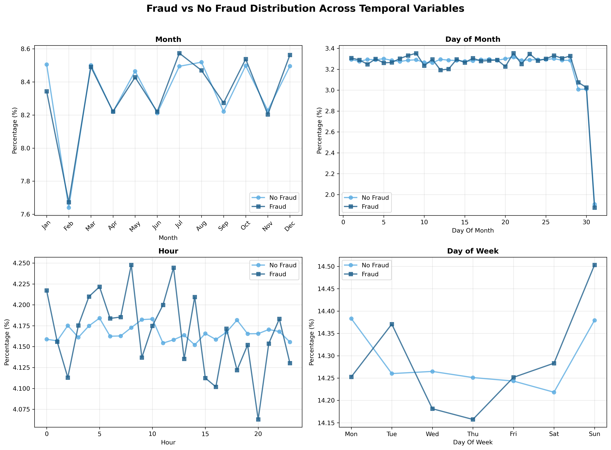 

#### Drop features
- timestamp
- fraud_type
- transaction_id
- NULL rows from time_since_last_transaction, after that there were 3923934 negative fraud cases and positive fraud cases initial number: 179553 were not altered.

- The ip_address and device_hash features were removed considering:

  - Both are cardinal columns
  - ip_address had only 6 repetitions values in fraud cases and a maximum of 2 repetitions
  - device_hash had 1,757 repeated values and a maximum of 3 repetitions
  - Fraudulent activity is moderately concentrated in certain devices and minimally traceable through IP addresses. Given the dataset size, both features contribute little information, and their removal reduces noise and dimensionality.

#### Final Features Selected

- sender_account
- receiver_account
- amount
- transaction_type
- merchant_category
- location
- device_used
- is_fraud
- time_since_last_transaction
- spending_deviation_score
- velocity_score
- geo_anomaly_score
- payment_channel
- year
- month
- day_of_month
- hour
- day_of_week

### Predictive Model

#### Model Purpose

The purpose of this predictive model is to detect and flag potentially fraudulent financial transactions with high accuracy. It was used selected features from the original dataset and newly engineered variables designed to enhance predictive power. By maximizing the detection rate of fraudulent activity, the system aims to reduce financial losses, protect users, and strengthen the risk‑management capabilities of financial institutions.

#### Building the Model
Because the objective is to detect financial fraud, the cost of labeling a fraudulent transaction as legitimate (false negative) is significantly worse than the reverse scenario. Therefore, fraud detection systems are usually more tolerant of false positives than false negatives. With this premise in mind, several models were built.

It is important to note that the original dataset had a significant class imbalance, with 95.6% legitimate transactions versus 4.4% fraudulent transactions. For this reason, balancing techniques were applied when necessary.

Overall, the final pipeline consists of three main steps:
- Preprocessing
- Balancing method (when necessary): SMOTE (Synthetic Minority Oversampling Technique) or Balanced Random Forest
- Model Training

Because the entire dataset is large, sample sets of different sizes were selected from the original dataset to ensure efficiency and reduce model training time. The class distribution from the original dataset was preserved in the final sample datasets selected. Additionally, high cardinality identifiers were dropped in almost all models.

Different approaches were taken to train the final models:
- Logistic Regression models:
  - 30_percent_approach
  - Logistic_regression_model_1
  - Logistic_regression_model
- Random Forest Modeñs
  -  Random_forest_2
  - Random_forest
- Tree_based_models_comparison
- Model_comparisons_logistic_regression_vs_tree_based

**Models with SMOTE**

- **Logistic_regression_model_1**
    - The entire dataset was used to train the model.
    - Due to the size of the dataset, this model was one of the slowest models.

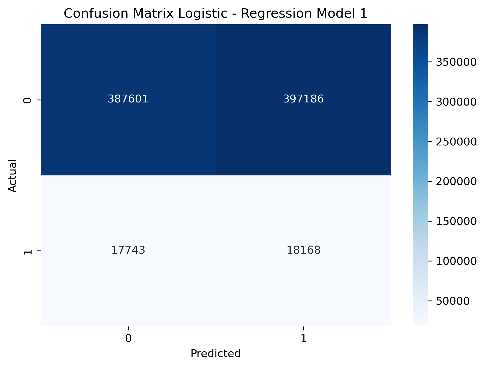

- **Logistic_regression_model**
    - A 20% sample of the entire dataset was taken.

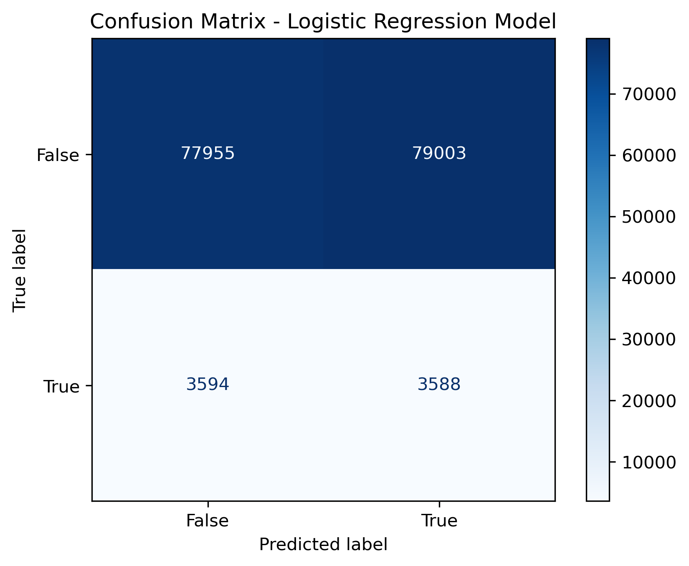

- **Random_forest and Random_forest_2**
  - A 20% sample of the dataset was selected for both models.
  - In the first Random Forest model, SMOTE was used to handle class imbalance.
  - In the second Random Forest model, SMOTE was not used; instead, a Random Forest classifier with class_weight="balanced" was applied.

  **- WHAT IS THE DIFERENCE BETWEEN THE MODELS?**

  - Both models had a lot of false positives. Random Forest 2 performed better, with recall 0.63 vs. 0.40. In Random Forest 1, the accuracy is higher at 0.59 vs. 0.38 in RF 2.

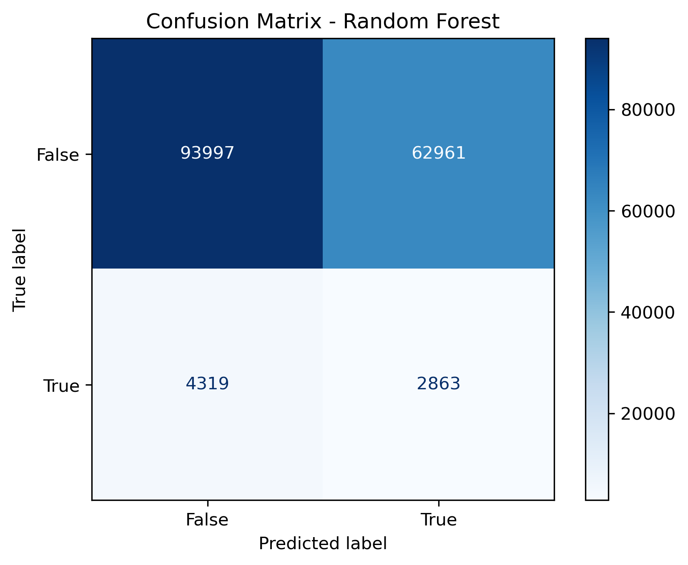

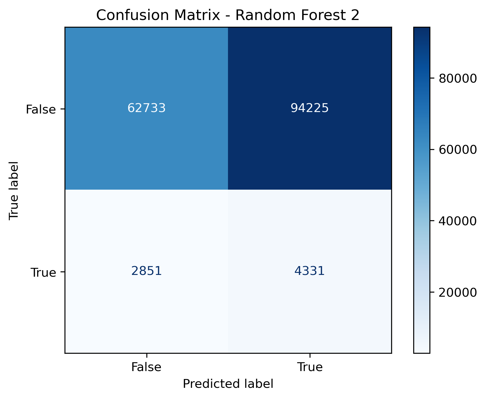

- **Model_comparisons_logistic_regression_vs_tree_based**
  - 2% of the entire dataset was used.
  - The final enhanced dataset was created with all engineered fraud-specific features:
    - Transaction frequency features grouped by sender account according to amount (mean, std, count) and unique locations to capture **behavioral patterns**.
    - **Time-based features:** extracted from date strictly as hour of day, night-time flag (0 to 5h), and business-hours flag (9 to 17h).
    - **Transaction amount-based features**: transformations with log-scaled amount and z-score.
    - **Behavioral anomaly scores:** derived from existing anomaly scores.
    - **Integrated payment-method risk encoding**.
  - The train and test datasets were split by sorting transactions chronologically, allocating the oldest 80% for training and the most recent 20% for testing to avoid temporal leakage, falling back to a stratified split when time data was unavailable.
  - The final dataset for this model had 3,282,789 (train) and 820,698 (test) rows, with closely aligned fraud rates (~4.37% vs. ~4.40%).
  - Final dataset had 4 categorical and 17 numerical features.
  - For categorical features, target encoding was used instead of one-hot encoding, as it performs better for tree-based models and reduces memory usage.
  - Due to severe class imbalance (22:1 ratio), SMOTE alone was insufficient. Therefore, a combination approach was used: SMOTE with strategic under-sampling, oversampling the minority class to 10%. Additionally, fewer neighbors were used for the sparse minority class. The target class ratio after resampling was 25% fraud (1:3).
  - After applying SMOTE, multiple models were trained and evaluated on the training and test (non-SMOTE) data. All four models evaluated — Logistic Regression, Random Forest, XGBoost, and LightGBM — struggled to distinguish fraud from non-fraud, showing low precision and weak PR-AUC. While they detected some fraudulent cases, their performance was too limited and unstable for real-world deployment.

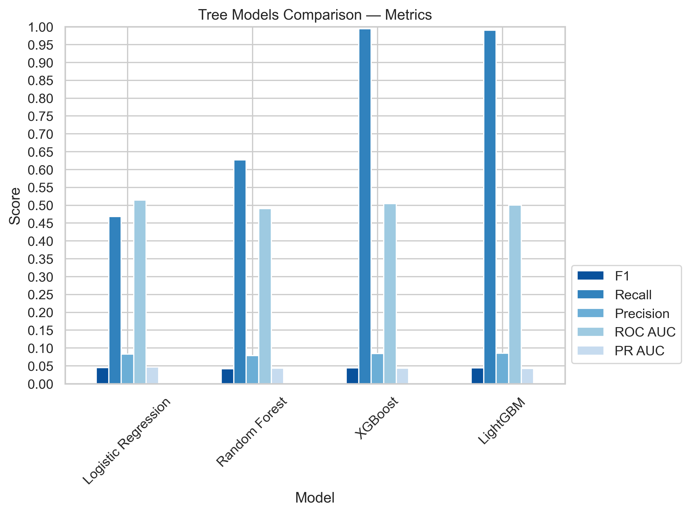

##### Model without SMOTE 

- **30_percent_approach**
    - The sample size was reduced for faster experimentation by selecting a random sample of 30% of the true cases and matching that with an equal number of randomly selected false cases.
    - The final balanced dataset had 50% false cases and 50% true cases. In this case, since the dataset is balanced, SMOTE was not required.
    - Class distribution: 50/50

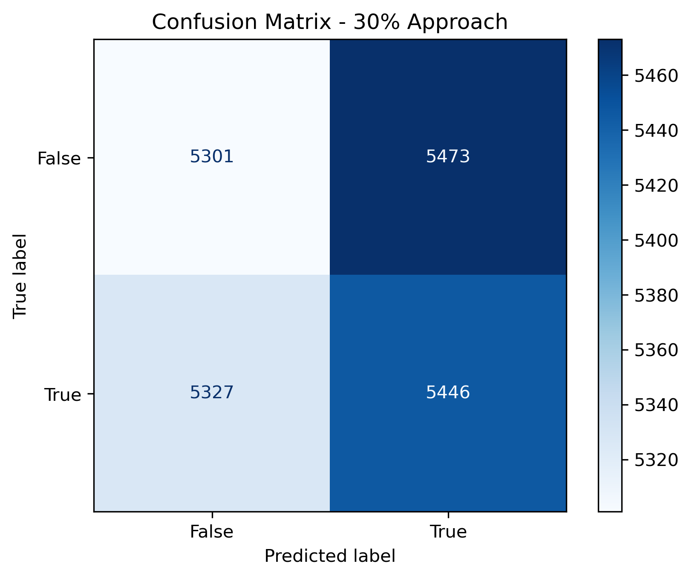    

- **Tree_based_models_comparison:**
  - Models compared: RandomForest + SMOTE, Balanced Random Forest, XGBoost, and LightGBM.
  - 20% of the original dataset was used as a sample.
  - Balanced Random Forest was used to balance the dataset.

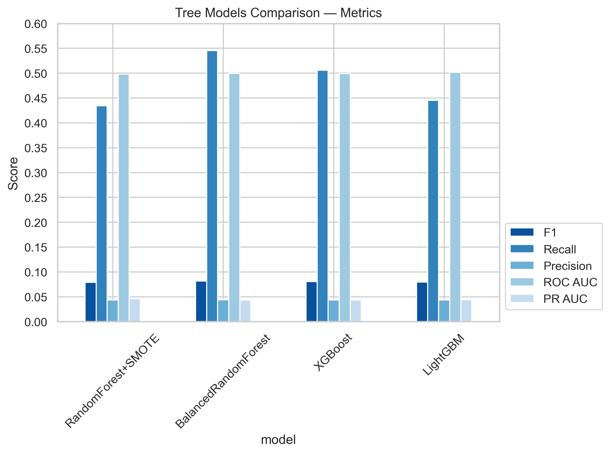

**Model performance:**
| Model | ROC AUC | PR AUC | Recall | Precision | F1 | Accuracy | Notes |
|-------|---------|--------|--------|-----------|----|----|-------|
| **Logistic Regression** (comparison) | **0.5204** | **0.0465** | 0.504 | 0.0467 | 0.085 | - | Best discriminator |
| LightGBM (comparison) | 0.5017 | 0.0441 | 0.445 | 0.0438 | 0.080 | - | Best tree-based |
| Random Forest 2 | 0.4984 | 0.0437 | **0.630** | 0.0434 | 0.081 | 0.38 | Catches most fraud |
| BalancedRandomForest | 0.4995 | 0.0435 | 0.546 | 0.0442 | 0.082 | - | Good recall balance |
| XGBoost (comparison) | 0.5016 | 0.0441 | 1.00 | 0.0440 | 0.084 | - | Perfect recall, impractical |
| Random Forest | 0.4982 | 0.0437 | 0.399 | 0.0435 | 0.078 | **0.59** | Most stable |
| 30% Approach | 0.4978 | 0.4978 | 0.505 | 0.499 | 0.502 | 0.50 | Baseline |
| Logistic Regression (model) | 0.4965 | 0.0435 | 0.500 | 0.0434 | 0.080 | 0.50 | Balanced |

#### Model Conclusion and Next Steps

All models evaluated showed limited ability to distinguish fraud from non-fraud transactions, with ROC AUC scores near 0.50, indicating performance close to random chance. The best discriminator overall was **Logistic Regression (comparison)** with a ROC AUC of 0.5204 and PR AUC of 0.0465, while **XGBoost** achieved perfect recall (1.00) but at the cost of being completely impractical due to an overwhelming number of false positives. The **30% Approach** showed the most balanced precision-recall trade-off (F1: 0.502), suggesting that dataset balancing strategy has a significant impact on model behavior.

The core challenge across all models is the extreme class imbalance (~95.6% non-fraud vs. ~4.4% fraud), which makes it difficult for models to learn meaningful fraud patterns. Techniques such as SMOTE and Balanced Random Forest improved recall but did not translate into reliable precision, confirming that resampling alone is insufficient for this problem.

**Next Steps:**

- **Feature engineering:** Explore deeper behavioral features such as transaction velocity per user, time-gap patterns, and network-based features linking senders and receivers.
- **Threshold tuning:** Optimize classification thresholds to improve the precision-recall trade-off based on the business cost of false positives vs. false negatives.
- **Advanced models:** Investigate anomaly detection approaches (Isolation Forest, Autoencoders) and graph-based models that can capture relationships between accounts.
- **Cost-sensitive learning:** Incorporate misclassification costs directly into the model training process to penalize missed fraud cases more heavily.
- **Larger training sample:** Evaluate whether increasing the training sample size beyond 20-30% yields meaningful performance improvements.
- **Ensemble methods:** Combine the strengths of multiple models (e.g., LightGBM + Logistic Regression) through stacking or voting to improve overall stability and performance.

### Technical Stack

#### Programming Language

- Python
- SQL

#### Libraries Used
**Data Management & Storage**
- **pandas** — Data manipulation and analysis
- **numpy** — Numerical computing and array operations
- **duckdb** — In-process SQL analytics for large dataset querying
- **os** — File system and directory management

**Data Collection**
- **kagglehub** — Kaggle dataset downloading and management

**Data Visualization**
- **matplotlib** — Static plot and figure generation
- **seaborn** — Statistical data visualization

**Data Preprocessing & Feature Engineering**
- **sklearn.preprocessing** — Feature scaling and encoding (StandardScaler, OneHotEncoder)
- **sklearn.impute** — Missing value handling (SimpleImputer, KNNImputer)
- **sklearn.compose** — Column transformation pipelines (ColumnTransformer)
- **scipy.stats** — Statistical analysis and transformations

**Machine Learning & Modeling**
- **sklearn.linear_model** — Logistic Regression
- **sklearn.pipeline** — ML pipeline construction
- **imblearn.pipeline** — Imbalanced-aware pipeline (ImbPipeline)

**Class Imbalance Handling**
- **imblearn.over_sampling** — Synthetic minority oversampling (SMOTE)

**Model Selection & Evaluation**
- **sklearn.model_selection** — Train/test splitting, cross-validation, and hyperparameter tuning (train_test_split, StratifiedKFold, cross_val_score, HalvingGridSearchCV)
- **sklearn.metrics** — Model evaluation metrics (F1, Precision, Recall, ROC AUC, PR AUC, precision_recall_curve, ConfusionMatrixDisplay)

### References

- 1. Financial Fraud: A Review of Anomaly Detection Techniques and Recent Advances
     Hilal et al. - Expert Systems with Applications - 2022, <https://doi.org/10.1016/j.eswa.2021.116429>
